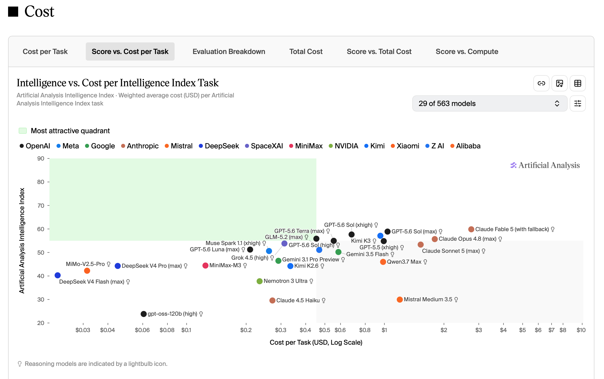
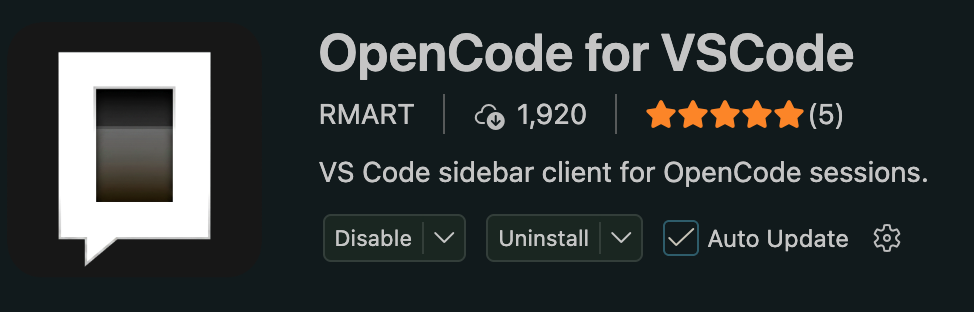

# Tutorial

Informações para configurar todo o projeto, incluindo o agente de IA e o OpenCode.

## 1. Configure o OpenCode

O opend é uma plataforma que permite a integração de agentes de IA com diversos serviços e bibliotecas. Siga os passos abaixo para configurar o OpenCode e preparar o ambiente para o agente.

1. Install OpenCode

```bash
brew install opencode
```

2. Acesse o site [OpenCode](https://opencode.com) e crie uma conta.

Salve sua chave de API em um local seguro, pois você precisará dela para configurar o agente.

Coloque créditos em sua conta para usar o agente.

3. Siga as instruções em
[Instruções de Integração do OpenCode](https://openrouter.ai/docs/cookbook/coding-agents/opencode-integration#homebrew).

4. Configure-o para usar o modelo mais barato, favoritando-o:
   
```bash
opencode
```

Em seguida:

```bash
\models
```

Procure pelos seguintes modelos e use `ctrl+f` para favoritar:

* DeepSeek V4 Pro
* DeepSeek V4 Flash
* GLM 5.2

Site para acompanhar os melhores modelos de IA:

[Artificial Analysis Intelligence Index](https://artificialanalysis.ai/evaluations/artificial-analysis-intelligence-index?eval-token-usage=score-vs-output-tokens-per-task&eval-cost=intelligence-vs-cost-per-task)

**Gráfico de custos é o mais importante:**


## 2. Configure MCPs
Model Context Protocol (MCP) é um protocolo de comunicação entre o agente de IA e o OpenCode, permitindo que o agente acesse informações contextuais relevantes para suas tarefas.

### Context 7 MCP

O context 7 serve para buscar documentação de bibliotecas.

[Context 7](https://context7.com)

1. Rode:
```bash
npx ctx7 setup --opencode
```

1. No terminal, selecione MCP-SERVER.

2. E entre no link que aparecerá no terminal para autenticar. 
3. Log e autorize.
   
### Safari

Serve para ver e controlar o browser.

[MCPSafari](https://github.com/Epistates/MCPSafari)

1. Rode:
   
```bash
brew install --cask epistates/tap/mcp-safari
```

--(está falhando no momento).--

## 3. Instale Skills

Skills são módulos de funcionalidade que permitem ao agente realizar tarefas específicas. 

Abaixo estão algumas skills recomendadas:

### Design Skill

1. [Design Skill](https://github.com/Nutlope/hallmark)

```bash
npx skills add -g nutlope/hallmark
```

-g indica que a skill será instalada globalmente, permitindo que o agente a utilize em qualquer projeto.

2. Mais skills...

Você pode explicitamente usar a skill dentro do opencode com o comando:

        \<nome da skill> 


## 4. Configure o markdown para o Agente

Se você se encontrar reescrevendo o mesmo conteúdo repetidamente, considere criar um snippet de markdown para o agente. Isso permitirá que você reutilize o conteúdo sem precisar reescrevê-lo.

1. Abra o arquivo AGENTS.md no diretório de configuração do OpenCode:

```bash
code ~/.config/opencode/AGENTS.md
```
2. Adicione o snippet de markdown desejado, por exemplo:

```markdown
<!-- context7 -->
Use Context7 MCP to fetch current documentation whenever the user asks about a library, framework, SDK, API, CLI tool, or cloud service — even well-known ones like React, Next.js, Prisma, Express, Tailwind, Django, or Spring Boot. This includes API syntax, configuration, version migration, library-specific debugging, setup instructions, and CLI tool usage. Use even when you think you know the answer — your training data may not reflect recent changes. Prefer this over web search for library docs.
<!-- context7 --> 
```

## 5. Instale extensão do opencode no VSCode

1. Abra o VSCode e vá para a aba de extensões.
2. Pesquise por "OpenCode for VScode" e instale a seguinte extensão.

**Identifier: rodrigomart123.opencode-for-vscode**



